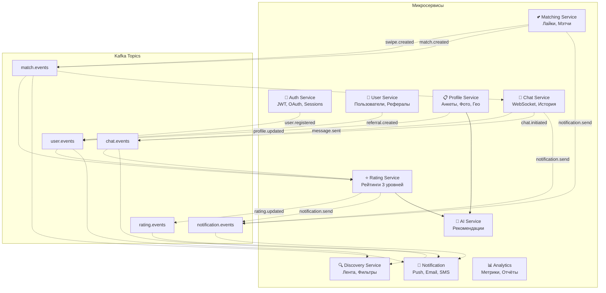

```mermaid
flowchart TB
    subgraph Services["Микросервисы"]
        Auth["🔐 Auth Service<br/>JWT, OAuth, Sessions"]
        User["👤 User Service<br/>Пользователи, Рефералы"]
        Profile["📋 Profile Service<br/>Анкеты, Фото, Гео"]
        Match["💕 Matching Service<br/>Лайки, Мэтчи"]
        Rating["⭐ Rating Service<br/>Рейтинги 3 уровней"]
        Discovery["🔍 Discovery Service<br/>Лента, Фильтры"]
        Chat["💬 Chat Service<br/>WebSocket, История"]
        Notify["🔔 Notification<br/>Push, Email, SMS"]
        AI["🤖 AI Service<br/>Рекомендации"]
        Analytics["📊 Analytics<br/>Метрики, Отчёты"]
    end

    subgraph Kafka_Topics["Kafka Topics"]
        T_User["user.events"]
        T_Match["match.events"]
        T_Chat["chat.events"]
        T_Rating["rating.events"]
        T_Notify["notification.events"]
    end

    Auth -.->|"user.registered"| T_User
    Profile -.->|"profile.updated"| T_User
    User -.->|"referral.created"| T_User

    Match -.->|"swipe.created"| T_Match
    Match -.->|"match.created"| T_Match

    Chat -.->|"message.sent"| T_Chat
    Chat -.->|"chat.initiated"| T_Chat

    Rating -.->|"rating.updated"| T_Rating

    T_User -.-> Rating
    T_User -.-> Discovery
    T_Match -.-> Rating
    T_Match -.-> Notify
    T_Match -.-> Chat
    T_Chat -.-> Rating
    T_Chat -.-> Notify
    T_Rating -.-> Discovery

    Match & Chat & Rating -.->|"notification.send"| T_Notify
    T_Notify -.-> Notify

    Profile --> AI
    Rating --> AI
```
