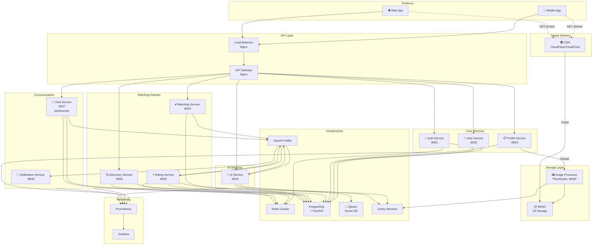
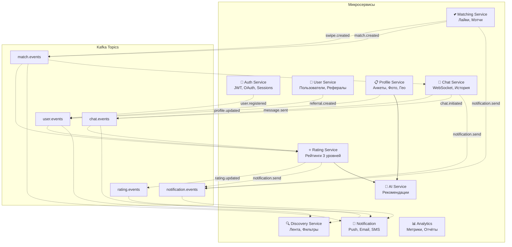

# Dating App - Микросервисная Архитектура

## Технологический стек

| Компонент | Технология |
|-----------|------------|
| Backend | Python + FastAPI |
| Database | PostgreSQL |
| Vector DB | Qdrant |
| Cache | Redis |
| Message Queue | Apache Kafka |
| Task Queue | Celery |
| Object Storage | MinIO (S3-compatible) |
| CDN | тоже не факт |
| AI/ML | OpenAI API / LangChain / DSPy / LangGraph (но не факт пока) |
| Monitoring | Prometheus + Grafana |
| Container | Docker + Docker Compose |

---

## 1. Архитектурная диаграмма (High-Level)

## 6. Диаграмма сервисов и их взаимодействия

---