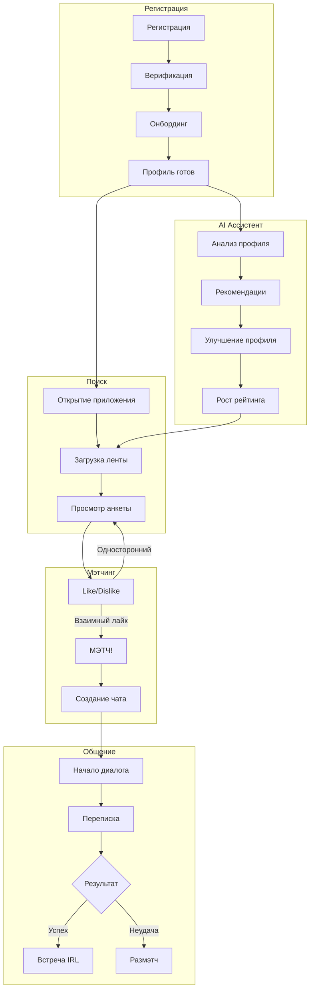

# Dating App - Бизнес-логика и функциональность

## Содержание

1. [Регистрация и онбординг](#1-регистрация-и-онбординг)
2. [Профиль пользователя](#2-профиль-пользователя)
3. [Система поиска и Discovery](#3-система-поиска-и-discovery)
4. [Свайпы и мэтчинг](#4-свайпы-и-мэтчинг)
5. [Система рейтингов](#5-система-рейтингов)
6. [Чат и коммуникация](#6-чат-и-коммуникация)
7. [AI-ассистент](#7-ai-ассистент)
8. [Реферальная программа](#8-реферальная-программа)
9. [Подписки и монетизация](#9-подписки-и-монетизация)
10. [Уведомления](#10-уведомления)
11. [Модерация и безопасность](#11-модерация-и-безопасность)

---

## 1. Регистрация и онбординг

### 1.1 Способы регистрации

| Способ | Описание |
|--------|----------|
| Email + пароль | Классическая регистрация с подтверждением email |
| Телефон + SMS | Регистрация по номеру телефона с OTP кодом |
| OAuth | Google, Apple, VK (получаем email и базовые данные) |

### 1.2 Процесс онбординга

```
1. Регистрация (email/телефон/OAuth)
      ↓
2. Подтверждение (email link / SMS код)
      ↓
3. Базовая информация
   - Имя
   - Дата рождения (проверка 18+)
   - Пол
      ↓
4. Фотографии (минимум 1, рекомендуется 3+)
      ↓
5. О себе (bio) - опционально, но рекомендуется
      ↓
6. Интересы (выбор из списка, минимум 3)
      ↓
7. Предпочтения поиска
   - Кого ищу (пол)
   - Возрастной диапазон
   - Максимальное расстояние
      ↓
8. Геолокация (запрос разрешения)
      ↓
9. Готово! Показываем первые анкеты
```

### 1.3 Верификация аккаунта

**Верификация по фото:**
1. Пользователь делает селфи с определённым жестом (показываем пример)
2. AI сравнивает селфи с фотографиями в профиле
3. При успехе - синяя галочка в профиле
4. Верифицированные профили получают +20 к рейтингу

---

## 2. Профиль пользователя

### 2.1 Обязательные поля

| Поле | Описание | Валидация |
|------|----------|-----------|
| Имя | Отображаемое имя | 2-50 символов, без спецсимволов |
| Дата рождения | Для расчёта возраста | 18-100 лет |
| Пол | male / female / non_binary | Enum |
| Фото | Минимум 1 фото | JPEG/PNG, до 10MB |

### 2.2 Опциональные поля

| Поле | Влияние на рейтинг |
|------|-------------------|
| Bio (описание) | +10 баллов если > 50 символов |
| Рост | +2 балла |
| Образование | +3 балла |
| Работа/должность | +3 балла |
| Интересы (3+) | +5 баллов за каждый (до +15) |
| Дополнительные фото | +5 баллов за каждое (до +25) |

### 2.3 Completion Score (полнота профиля)

```
Формула: 0-100 баллов

Базовые поля (заполнены = 40 баллов):
  - Имя, возраст, пол: автоматически

Фотографии (до 30 баллов):
  - 1 фото: +5
  - 2-3 фото: +15
  - 4-6 фото: +30

Описание (до 15 баллов):
  - Bio 20-50 символов: +5
  - Bio 50-150 символов: +10
  - Bio > 150 символов: +15

Дополнительно (до 15 баллов):
  - Интересы 3+: +5
  - Рост/работа/образование: +5
  - Верификация: +5
```

---

## 3. Система поиска и Discovery

### 3.1 Алгоритм формирования ленты

```
Входные данные:
  - Предпочтения пользователя (возраст, пол, расстояние)
  - Геолокация пользователя
  - Уже просмотренные профили (Redis set)

Алгоритм:
  1. Фильтрация по жёстким критериям:
     - Пол соответствует предпочтениям
     - Возраст в диапазоне
     - Расстояние <= max_distance
     - Не заблокирован
     - Не просмотрен ранее

  2. Сортировка по combined_rating (DESC)

  3. Добавление разнообразия:
     - 70% - топ по рейтингу
     - 20% - средний рейтинг (для fairness)
     - 10% - новые профили (< 7 дней)

  4. Кэширование batch по 10 анкет в Redis

Выдача:
  - При открытии приложения: загрузка первой анкеты + prefetch 10 в фоне
  - На 9-й анкете: prefetch следующих 10
  - TTL кэша: 1 час (потом пересчёт)
```

### 3.2 Фильтры (настройки поиска)

| Фильтр | Бесплатно | Premium |
|--------|-----------|---------|
| Возраст (диапазон) | ✅ | ✅ |
| Расстояние | До 100 км | Без ограничений |
| Пол | ✅ | ✅ |
| Только с фото | ✅ | ✅ |
| Только верифицированные | ❌ | ✅ |
| Только с bio | ❌ | ✅ |
| Онлайн сейчас | ❌ | ✅ |
| Рост (диапазон) | ❌ | ✅ |

---

## 4. Свайпы и мэтчинг

### 4.1 Типы действий

| Действие | Описание | Лимит (бесплатно) | Premium |
|----------|----------|-------------------|---------|
| **Like** (свайп вправо) | Симпатия | 50/день | Безлимит |
| **Dislike** (свайп влево) | Пропуск | Безлимит | Безлимит |
| **Super Like** | Выделенный лайк (уведомление) | 1/день | 5/день |
| **Rewind** | Отмена последнего свайпа | ❌ | 3/день |

### 4.2 Логика мэтча

```python
def process_swipe(user_a, user_b, action):
    if action == "dislike":
        save_swipe(user_a, user_b, "dislike")
        update_rating(user_b, "dislike_received")
        return {"match": False}

    if action in ["like", "super_like"]:
        save_swipe(user_a, user_b, action)

        # Проверяем взаимность
        if has_liked(user_b, user_a):
            # МЭТЧ!
            match = create_match(user_a, user_b)
            create_chat_room(match)
            notify_both_users(match)
            update_ratings_on_match(user_a, user_b)
            return {"match": True, "match_id": match.id}
        else:
            # Односторонний лайк
            if action == "super_like":
                notify_user(user_b, "super_like_received", user_a)
            update_rating(user_b, "like_received")
            return {"match": False}
```

### 4.3 Что происходит при мэтче

1. **Создаётся чат-комната** - оба могут писать друг другу
2. **Push-уведомление** обоим пользователям
3. **Обновление рейтингов** - оба получают +behavioral_score
4. **Анимация "It's a Match!"** в приложении
5. **AI генерирует conversation starters** (идеи для первого сообщения)

### 4.4 "Кто меня лайкнул" (Premium)

- Список пользователей, которые лайкнули вас
- Можно сразу лайкнуть в ответ (instant match)
- Или пропустить (dislike)
- Бесплатным пользователям показывается только количество и размытые фото

---

## 5. Система рейтингов

### 5.1 Зачем нужен рейтинг

- **Качество ленты**: пользователи с высоким рейтингом показываются чаще
- **Честность**: активные и "качественные" профили получают больше просмотров
- **Мотивация**: стимул заполнять профиль и вести себя адекватно

### 5.2 Уровень 1: Первичный рейтинг (Profile Score)

```
Рассчитывается при создании/обновлении профиля.
Диапазон: 0-100

Компоненты:
┌─────────────────────────────────────────┐
│ Полнота профиля (completion_score)  40% │
│ Количество и качество фото          30% │
│ Верификация аккаунта                20% │
│ Возраст аккаунта                    10% │
└─────────────────────────────────────────┘

Пример:
  - completion_score = 80 → 32 балла
  - 4 фото → 24 балла
  - Не верифицирован → 0 баллов
  - Аккаунт 30 дней → 8 баллов
  → Primary Rating = 64
```

### 5.3 Уровень 2: Поведенческий рейтинг (Behavioral Score)

```
Динамически обновляется на основе действий ДРУГИХ пользователей.
Диапазон: 0-100

Компоненты:
┌─────────────────────────────────────────┐
│ Like Ratio (лайки / показы)         30% │
│ Match Rate (мэтчи / лайки)          30% │
│ Chat Initiation Rate                25% │
│ Activity Bonus (время активности)   15% │
└─────────────────────────────────────────┘

Формулы:
  like_ratio = likes_received / (likes + dislikes)
  match_rate = matches / likes_given
  chat_rate = chats_initiated / matches

Пример:
  - 100 показов, 40 лайков → like_ratio = 0.4 → 12 баллов
  - 20 лайков отправлено, 8 мэтчей → match_rate = 0.4 → 12 баллов
  - 8 мэтчей, 5 диалогов начато → chat_rate = 0.625 → 15.6 баллов
  - Активен в прайм-тайм → 10 баллов
  → Behavioral Rating = 49.6
```

### 5.4 Уровень 3: Комбинированный рейтинг

```
Финальный рейтинг для сортировки в ленте.
Диапазон: 0-100

Формула:
  combined = (primary × 0.30) + (behavioral × 0.60) + (bonuses × 0.10)

Бонусы:
  - Реферальный бонус: +2 за каждого приглашённого (макс +20)
  - Premium подписка: +10

Пример:
  - Primary = 64, Behavioral = 50, Referrals = 3
  - combined = (64 × 0.3) + (50 × 0.6) + (6 × 0.1)
  - combined = 19.2 + 30 + 0.6 = 49.8
```

### 5.5 Пересчёт рейтингов (Celery)

| Задача | Расписание | Описание |
|--------|------------|----------|
| `recalculate_active_users` | Каждый час | Пересчёт для пользователей, активных за 24ч |
| `recalculate_all_users` | Раз в сутки (ночью) | Полный пересчёт всех рейтингов |
| `update_rating_on_event` | Real-time | При лайке/мэтче/сообщении |

---

## 6. Чат и коммуникация

### 6.1 Создание чата

- Чат создаётся автоматически при мэтче
- До мэтча общение невозможно (защита от спама)
- Первое сообщение должно быть отправлено в течение 7 дней (иначе мэтч "остывает")

### 6.2 Функции чата

| Функция | Бесплатно | Premium |
|---------|-----------|---------|
| Текстовые сообщения | ✅ | ✅ |
| Эмодзи | ✅ | ✅ |
| GIF | ✅ | ✅ |
| Фото | ❌ | ✅ |
| Голосовые сообщения | ❌ | ✅ |
| Прочитано / доставлено | ❌ | ✅ |
| Typing indicator | ❌ | ✅ |

### 6.3 Размэтч (Unmatch)

- Любой пользователь может размэтчиться
- При размэтче:
  - Чат удаляется для обоих
  - Профили больше не показываются друг другу
  - Нельзя повторно лайкнуть (permanent block)

### 6.4 Жалобы из чата

- Кнопка "Пожаловаться" в меню чата
- Причины: спам, оскорбления, мошенничество, неприемлемый контент
- При жалобе: автоматический размэтч + отправка на модерацию

---

## 7. AI-ассистент

### 7.1 Анализ профиля

**Когда запускается:**
- При первом заполнении профиля
- При обновлении фото/bio
- По запросу пользователя
- Автоматически раз в неделю (фоново)

**Что анализирует:**
```
┌─────────────────────────────────────────┐
│ ФОТО                                    │
│ • Качество (освещение, резкость)        │
│ • Видно ли лицо                         │
│ • Улыбка (да/нет)                       │
│ • Групповые фото (предупреждение)       │
│ • NSFW контент (блокировка)             │
├─────────────────────────────────────────┤
│ BIO (описание)                          │
│ • Длина (короткое/оптимальное/длинное)  │
│ • Тон (дружелюбный/нейтральный/негатив) │
│ • Уникальность vs шаблонность           │
│ • Грамматика                            │
├─────────────────────────────────────────┤
│ ИНТЕРЕСЫ                                │
│ • Количество (мало/достаточно/много)    │
│ • Популярность (для мэтчинга)           │
│ • Разнообразие                          │
└─────────────────────────────────────────┘
```

### 7.2 Рекомендации по улучшению

**Формат рекомендации:**
```json
{
  "type": "photo",
  "priority": "high",
  "title": "Добавьте фото с улыбкой",
  "message": "Профили с улыбающимися фото получают на 30% больше лайков. Ваше главное фото выглядит серьёзным.",
  "action": "upload_photo",
  "expected_improvement": "+15% лайков"
}
```

**Типы рекомендаций:**
| Тип | Примеры |
|-----|---------|
| `photo` | "Добавьте больше фото", "Уберите групповое фото", "Улучшите освещение" |
| `bio` | "Расскажите о хобби", "Добавьте юмор", "Укоротите текст" |
| `interests` | "Добавьте популярные интересы", "Слишком общие теги" |
| `activity` | "Заходите в прайм-тайм (19-22)", "Отвечайте быстрее" |
| `strategy` | "Расширьте возрастной диапазон", "Попробуйте Super Like" |

### 7.3 Conversation Starters

**Когда генерируются:**
- Сразу после мэтча
- На основе профиля собеседника

**Пример:**
```
Мэтч с Анной, 25 лет
Интересы: путешествия, йога, кофе

AI предлагает:
1. "Вижу, ты любишь путешествовать! Какое место впечатлило больше всего? 🌍"
2. "Йога утром или вечером? Я всё никак не могу определиться 😅"
3. "Кофейный вопрос: латте или капучино? ☕"
```

### 7.4 Семантический поиск (Qdrant)

**Как работает:**
1. При создании/обновлении профиля → генерируем embedding (bio + интересы)
2. Сохраняем в Qdrant с метаданными (пол, возраст, город)
3. При поиске → находим похожие профили по смыслу, а не только по тегам

**Пример:**
```
Пользователь: "Люблю горы и активный отдых"
Найдёт: "Увлекаюсь хайкингом и скалолазанием"
(даже если нет общих интересов-тегов)
```

---

## 8. Реферальная программа

### 8.1 Механика

```
┌─────────────────────────────────────────────────────────┐
│                    РЕФЕРАЛЬНАЯ ПРОГРАММА                │
├─────────────────────────────────────────────────────────┤
│                                                         │
│  Пригласивший (Referrer)      Приглашённый (Referee)   │
│  ────────────────────────     ──────────────────────   │
│                                                         │
│  При регистрации реферала:                             │
│  • +5 Super Likes              • +3 Super Likes        │
│  • +2 к рейтингу (постоянно)   • +1 неделя Premium*   │
│                                                         │
│  При первом мэтче реферала:                            │
│  • +1 неделя Premium           • (ничего)              │
│                                                         │
│  При покупке Premium рефералом:                        │
│  • 20% от суммы (кэшбэк)       • (ничего)              │
│                                                         │
│  * Premium trial только для новых пользователей        │
└─────────────────────────────────────────────────────────┘
```

### 8.2 Реферальный код

- **Формат**: 8 символов (буквы + цифры), например: `KATE2024`
- **Уникальный** для каждого пользователя
- **Можно кастомизировать** (Premium): выбрать своё слово

### 8.3 Способы поделиться

1. **Копировать код** - вставить в любой мессенджер
2. **Share ссылка** - `https://app.dating.com/ref/KATE2024`
3. **QR-код** - для офлайн (в баре, на мероприятии)

### 8.4 Лимиты и защита от абуза

| Ограничение | Значение |
|-------------|----------|
| Макс. рефералов | Без ограничений |
| Макс. бонус к рейтингу | +20 (10 рефералов) |
| Минимальная активность реферала | Должен сделать 10+ свайпов |
| Cooldown между рефералами | 1 час (защита от ботов) |

---

## 9. Подписки и монетизация

### 9.1 Уровни подписки

```
┌─────────────────────────────────────────────────────────┐
│  FREE                  PREMIUM              PREMIUM+   │
│  (Бесплатно)           (₽499/мес)           (₽799/мес) │
├─────────────────────────────────────────────────────────┤
│                                                         │
│  Лайки: 50/день        Безлимит             Безлимит   │
│  Super Likes: 1/день   5/день               10/день    │
│  Rewind: ❌            3/день               Безлимит   │
│                                                         │
│  Кто лайкнул: ❌        ✅                   ✅          │
│  Расстояние: 100км     Безлимит             Безлимит   │
│  Фильтры: базовые      Расширенные          Все        │
│                                                         │
│  Read receipts: ❌      ✅                   ✅          │
│  Typing indicator: ❌   ✅                   ✅          │
│  Фото в чате: ❌        ✅                   ✅          │
│                                                         │
│  AI рекомендации: ❌    1/неделю            Безлимит   │
│  Boost: ❌              1/месяц             4/месяц    │
│  Приоритет в ленте: ❌  ❌                   ✅          │
│                                                         │
│  Реклама: Есть         Нет                  Нет        │
└─────────────────────────────────────────────────────────┘
```

### 9.2 Разовые покупки (In-App)

| Товар | Цена | Описание |
|-------|------|----------|
| 5 Super Likes | ₽149 | Не сгорают |
| 1 Boost (30 мин) | ₽199 | Топ ленты на 30 минут |
| 5 Boosts | ₽699 | Экономия 30% |
| "Кто лайкнул" (разово) | ₽299 | Доступ на 24 часа |

### 9.3 Boost (ускорение)

**Что делает:**
- Профиль показывается в топе ленты 30 минут
- В среднем +10x просмотров
- Показывается badge "Популярный сейчас"

**Лучшее время для Boost:**
- Воскресенье, 20:00-22:00
- Будни, 21:00-23:00
- (AI подскажет оптимальное время)

### 9.4 Платёжные методы

- Apple Pay / Google Pay
- Банковская карта (Stripe)
- СБП (для России)
- Подписка через App Store / Google Play

---

## 10. Уведомления

### 10.1 Типы уведомлений

| Событие | Push | Email | In-App |
|---------|------|-------|--------|
| Новый мэтч | ✅ | ✅ | ✅ |
| Новое сообщение | ✅ | ❌ | ✅ |
| Super Like получен | ✅ | ❌ | ✅ |
| Кто-то лайкнул (Premium) | ✅ | ❌ | ✅ |
| Мэтч не отвечает 3 дня | ✅ | ❌ | ✅ |
| Напоминание зайти | ✅ | ❌ | ❌ |
| AI рекомендация готова | ❌ | ✅ | ✅ |
| Подписка истекает | ✅ | ✅ | ✅ |
| Реферал зарегистрировался | ✅ | ✅ | ✅ |

### 10.2 Настройки уведомлений

Пользователь может отключить:
- Все push-уведомления
- Уведомления о сообщениях (тихий режим ночью)
- Email-уведомления
- Напоминания о входе

---

## Диаграмма основных бизнес-процессов



---
