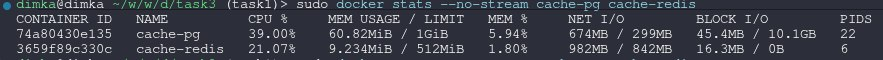

# Отчёт: сравнение стратегий кеширования

## Стенд

- **БД:** Postgres 16 (контейнер `cache-pg`, лимит 1 CPU / 1 GB).
- **Кеш:** Redis 7 (контейнер `cache-redis`, без AOF/RDB, лимит 1 CPU / 512 MB).
- **Application + load-gen:** Python 3.12 в контейнере `cache-runner`. Нагрузочные
  потоки и приложение живут в одном процессе — нас интересует относительное
  сравнение трёх стратегий в одинаковых условиях.
- Все три варианта используют **один и тот же** код приложения, кеш-обёртку и
  load-generator; меняется только класс стратегии ([src/app.py](../src/app.py)).

## Параметры теста

- Размер набора данных: **1000 ключей**, значение фиксированной длины 64 байта,
  равномерное распределение (uniform random).
- Перед каждым прогоном БД `TRUNCATE` и сидируется заново, Redis `FLUSHDB`.
  Кеш стартует **холодным**.
- Длительность прогона: **20 секунд**, **16 воркеров**.
- Нагрузка — три профиля:
  - `read_heavy` — 80% read / 20% write,
  - `balanced` — 50% / 50%,
  - `write_heavy` — 20% / 80%.
- Для `write_back`: `flush_interval = 0.5s`, `batch_size = 200`, при остановке
  очередь принудительно сбрасывается в БД (время — колонка `stop_drain_s`).

Воспроизведение:

```bash
bash scripts/run_all.sh 20 16 1000
```

## Результаты

### read-heavy (80/20)

| стратегия      | throughput, rps | avg lat, ms | p95 ms | DB reads | DB writes | hit rate |
|----------------|----------------:|------------:|-------:|---------:|----------:|---------:|
| cache_aside    |        11 331.8 |       1.408 |  3.793 |   37 355 |    45 156 |   0.7943 |
| write_through  |        12 923.2 |       1.234 |  3.433 |      823 |    51 513 |   0.9960 |
| write_back     |    **22 115.5** |   **0.721** |  1.808 |  **817** |    79 367 |   0.9977 |

### balanced (50/50)

| стратегия      | throughput, rps | avg lat, ms | p95 ms | DB reads | DB writes | hit rate |
|----------------|----------------:|------------:|-------:|---------:|----------:|---------:|
| cache_aside    |         8 002.2 |       1.996 |  3.990 |   40 369 |    80 368 |   0.4938 |
| write_through  |         8 612.3 |       1.853 |  4.476 |      529 |    86 534 |   0.9938 |
| write_back     |    **21 222.3** |   **0.751** |  1.874 |  **529** |   190 312 |   0.9975 |

### write-heavy (20/80)

| стратегия      | throughput, rps | avg lat, ms | p95 ms | DB reads | DB writes | hit rate |
|----------------|----------------:|------------:|-------:|---------:|----------:|---------:|
| cache_aside    |         7 189.9 |       2.221 |  3.959 |   22 963 |   115 270 |   0.1969 |
| write_through  |         7 936.6 |       2.012 |  3.825 |      218 |   127 237 |   0.9931 |
| write_back     |    **18 743.5** |   **0.851** |  2.145 |  **211** |   269 362 |   0.9972 |

### Что происходит при накоплении записей у write-back

| профиль      | logical writes | DB writes (после coalescing) | сэкономлено | wb_max_queue | flush batches | stop_drain, s |
|--------------|---------------:|-----------------------------:|------------:|-------------:|--------------:|--------------:|
| read_heavy   |         88 458 |                       79 367 |       10.3% |       83 325 |           397 |          2.50 |
| balanced     |        212 646 |                      190 312 |       10.5% |      207 688 |           952 |          5.23 |
| write_heavy  |        300 267 |                      269 362 |       10.3% |      295 363 |         1 347 |     **12.09** |

Что видно:

1. **Очередь dirty-ключей растёт линейно от write-нагрузки:** при 80% writes
   она достигла 295k — это все накопленные за 20 секунд записи, которые
   фоновый flusher не успел вылить пакетами по 200 строк.
2. **Batch-coalescing работает:** один и тот же ключ, обновлённый несколько
   раз подряд, схлопывается в один `UPDATE`. На равномерном распределении и
   1000 ключах это даёт стабильные ~10% экономии на DB writes.
3. **Цена graceful shutdown** видна в `stop_drain_s`: для `write_heavy` после
   формальных «20 секунд теста» приложение ещё **12 секунд** доливало
   накопленное в Postgres. Если процесс упадёт без shutdown — это и есть
   объём данных, который теряется (или должен подниматься из WAL/AOF).

## Выводы

### Чтение (read-heavy, 80/20)

- `write_back` обогнал остальных почти в **2×** по throughput (22k vs 12.9k у
  write-through и 11.3k у cache-aside). Причина — не сами чтения (они у всех
  идут через Redis), а то, что 20% writes у write-back почти бесплатны для
  клиента, и латентность общего пула операций ниже.
- У `cache_aside` бросается в глаза **hit rate 0.79** против ~1.0 у двух
  других — каждая запись делает `DEL`, и следующая чтение по этому ключу идёт
  в БД. Отсюда же 37k DB reads — реальная нагрузка на Postgres от чисто
  «читающего» сценария.
- **Лучший выбор:** `write_through` — простой, надёжный, hit rate 0.996,
  данные в БД консистентные сразу. `write_back` быстрее, но ради чисто чтения
  его сложность не оправдана.

### Запись (write-heavy, 20/80)

- `write_back` — **18.7k rps**, vs **7.9k** у `write_through` и **7.2k** у
  `cache_aside`. Латентность с клиентской стороны 0.85 мс vs 2.0+ мс — клиент
  платит только за один Redis `SET`.
- Но: 295k записей висели в очереди, и финальный drain занял 12 секунд —
  это окно, в которое потеря данных при падении максимальна.
- `cache_aside` хуже `write_through` по hit rate (0.20 vs 0.99) и по
  throughput — `DEL` на каждой записи плюс холодный кеш делают каждое
  последующее чтение походом в БД.
- **Лучший выбор:** `write_back` если допустимы потери и есть
  graceful shutdown / WAL у кеша; иначе `write_through`.

### Смешанная (balanced, 50/50)

- Те же тенденции: `write_back` ≈ **21.2k**, write_through и cache_aside
  ~8–8.6k. Разрыв `cache_aside`/`write_through` тут максимальный по hit rate
  (0.49 vs 0.99) — ровно из-за инвалидации на каждой второй операции.
- **Лучший выбор:** `write_back` по производительности, `write_through` —
  если важны прозрачность и согласованность.

### Сводная рекомендация

| сценарий                                          | рекомендация                                  |
|---------------------------------------------------|-----------------------------------------------|
| read-heavy, данные редко меняются                 | `write_through` (простой, hit rate ~1.0)      |
| writes должны быть видны в БД сразу и надёжно     | `write_through`                               |
| writes критичны по latency, потеря части допустима| `write_back` (с graceful shutdown / WAL)      |
| read-heavy + сложная инвалидация на стороне БД    | `cache_aside` (write-around — кеш не врёт)    |

### Когда `cache_aside` оказался хуже всех

В наших тестах он проиграл и по throughput, и по hit rate — потому что:

- Кеш стартует холодным и каждый `set` делает `DEL`, а не пишет в кеш.
- Распределение ключей равномерное, поэтому даже после прогрева 20% writes
  держат hit rate в районе 0.79 (read_heavy) и роняют его до 0.2 при
  write_heavy.

`cache_aside` имеет смысл там, где запись в БД не идёт через приложение
(другой сервис, миграция, ETL), и инвалидировать кеш — единственный
безопасный путь. На синтетике, где всё пишется через одно приложение,
`write_through` объективно лучше при сопоставимой простоте.

## Скрины

`docker stats --no-stream cache-pg cache-redis` снят во время прогона каждой
стратегии (`bash scripts/run_<strategy>.sh`). Видно нагрузку на БД и кеш в
момент тестов.

### cache_aside

![cache_aside — docker stats]

Postgres ~54% CPU, Redis ~7%. Высокая загрузка БД и при этом низкая Redis —
прямое следствие низкого hit rate: каждое write делает `DEL`, и большая
часть последующих чтений идёт мимо кеша в Postgres.

### write_back


Postgres всего ~5% CPU, Redis ~24% — нагрузка перевернулась. Запись идёт в
Redis, в Postgres flusher льёт батчи; БД работает гораздо легче, пиковую
нагрузку держит кеш.

### write_through


Postgres ~39% CPU, Redis ~21% — загружены оба, потому что каждая запись
синхронно идёт и туда, и туда. Это «честная» нагрузка на оба сервиса.

### Итог по скринам

| стратегия      | Postgres CPU | Redis CPU | где узкое место                      |
|----------------|-------------:|----------:|--------------------------------------|
| cache_aside    |          54% |        7% | Postgres (низкий hit rate)           |
| write_through  |          39% |       21% | оба синхронно                        |
| write_back     |           5% |       24% | Redis; БД получает батчи             |

Это согласуется с throughput из таблиц выше: чем меньше нагрузка на Postgres
(он лимитирован 1 CPU), тем выше rps.